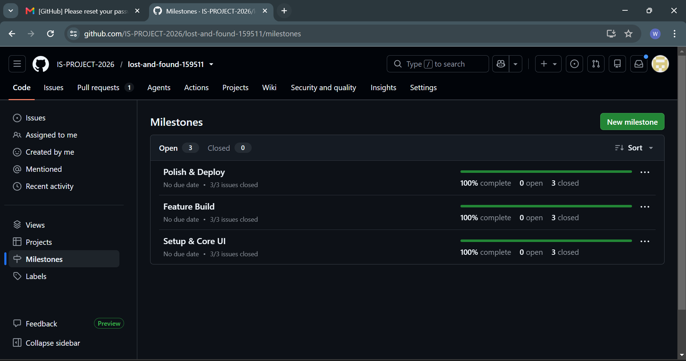
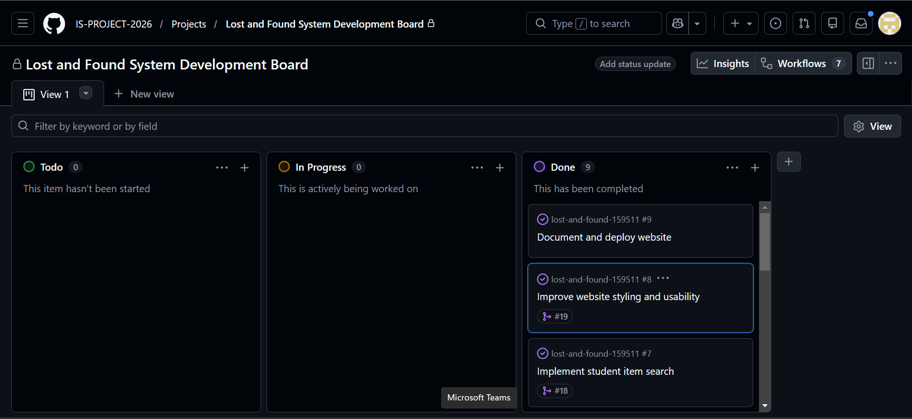
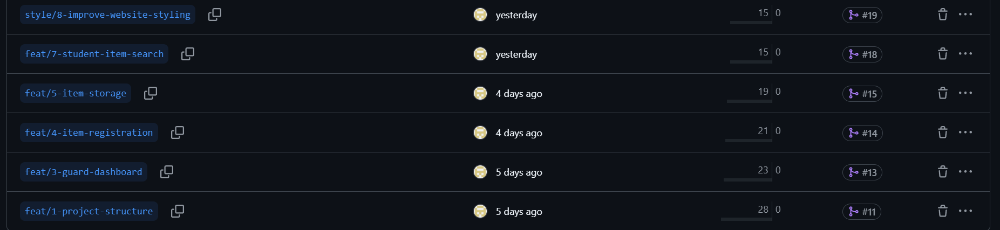
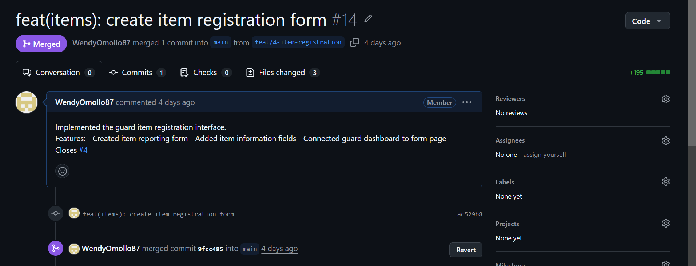
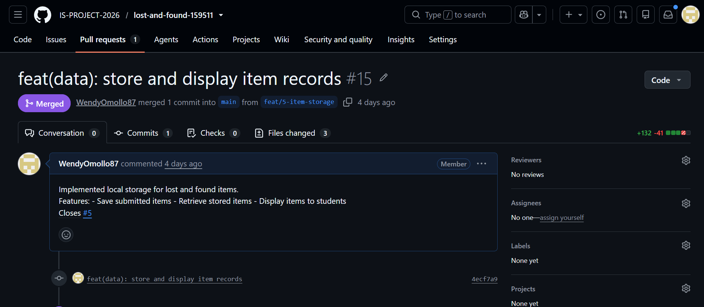
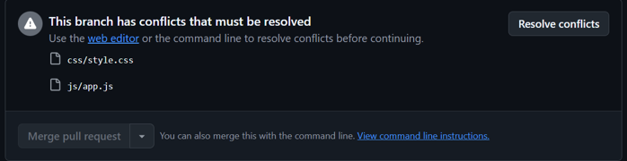
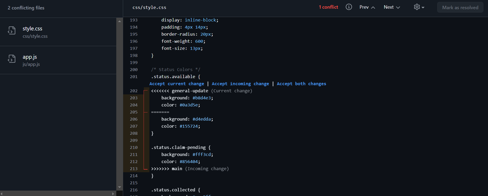
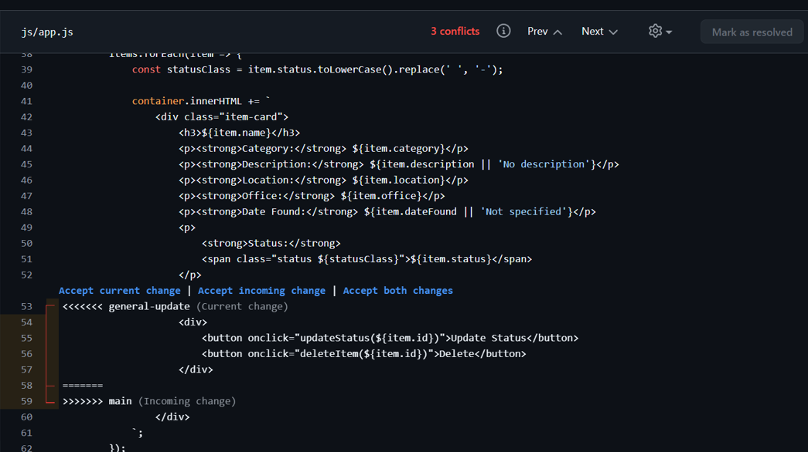
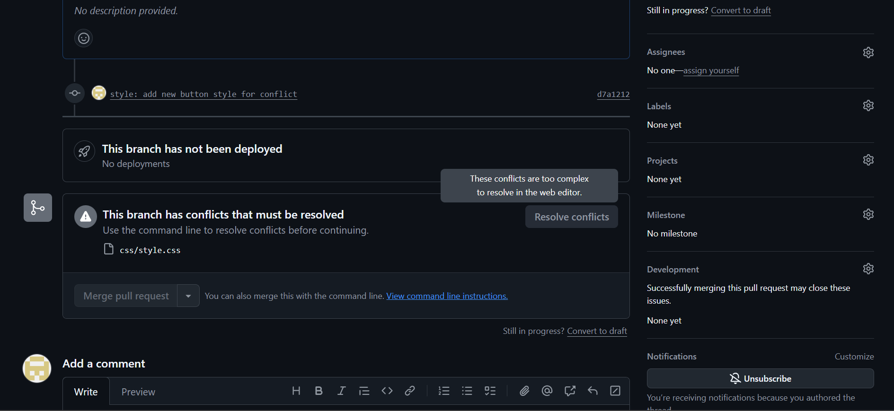

# Project Submission Report
## 1. Student Details
- **Full Name:** Wendy Omollo
- **GitHub Username:** WendyOmollo87
- **Email:**wendyomollo@students.university.com
- **Admission Number:** 159511

---
## 2. Deployed Project Link

- **Live GitHub Pages URL:** https://is-project-2026.github.io/lost-and-found-159511/index.html

## 3.  Reflection - Grounded in Your Git History
### A. Your Best Commit

- **Commit URL:** https://github.com/IS-PROJECT-2026/lost-and-found-159511/commit/1b0f739b9f7b7debedfef705ee7425223517515a

- **Why this one?** This commit follows the Conventional Commits specification with a clear `feat` type tag, a short but descriptive subject  and a body that explains exactly what was added (Add search button, implement case insensitive matching, Implement filtering by item name, category, and location). It also closes issue #7 directly in the commit message.

### B. A Mistake or Struggle

- **Link to the evidence:** https://github.com/IS-PROJECT-2026/lost-and-found-159511/pull/21

- **What happened and how did you recover?** I had merge conflicts when merging my feature branches into main. The conflicts occurred because two branches modified the same CSS properties in style.css. I recovered by carefully reviewing both versions, keeping the original green status color, and committing the resolution. I learned to always pull latest changes before starting new branches.

### C. A Pull Request You're Proud Of

- **PR URL:** https://github.com/IS-PROJECT-2026/lost-and-found-159511/pull/21

- **What did you check before merging?** I reviewed my own code changes to ensure the status update and delete functions worked correctly. I checked that the PR description clearly explained what was added and verified it correctly closed issue #6. I also tested the code locally before merging.
### D. One Thing You Would Do Differently

- **What would you change?** I would create more focused, single-purpose branches and delete them immediately after merging. I ended up with duplicate branches (feat/6-status-updates and feat/6-item-status-updates) that caused confusion.

- **Link to the evidence of the original decision:** https://github.com/IS-PROJECT-2026/lost-and-found-159511/branches

## 4. Screenshots of Key GitHub Features

### A. Milestones and Issues

* **Caption:** My project has 3 milestones: Setup & Core UI, Feature Build, and Polish & Deploy. Each milestone has linked issues that track specific tasks.

## B. Project Board

* **Caption:** My board shows tasks moving from To Do → In Progress → Done.It is for active project management throughout the development process.

### C. Branching Architecture

* **Caption:** My branches follow the naming convention: feat/, style/, and fix/ with issue numbers. This matches the requirement for conventional branch naming.

### D. Pull Requests & Traceability

* **Caption:** Each PR is linked to its corresponding issue. The PR descriptions explain what was changed.

---
## 5. Merge Conflict Evidence

### Conflict 1 — Content Conflict
**What cause did you use?** Content Conflict (Same file, same lines modified differently)
#### Step 1: Generating the Clash
![Conflict Warning]!
**Caption:** I created a pull request merging `conflict1-status` into `main`. GitHub detected conflicts in `css/style.css` and `js/app.js`. The warning showed "This branch has conflicts that must be resolved" with 2 conflicting files.
#### Step 2: Inside the Code Editor (Conflict Markers)
![Conflict Markers in style.css]
**Caption:** The conflict was in `css/style.css` for the `.status.available` class. One branch changed the background to blue (`#b8d4e3`) and the other kept the original green (`#d4edda`). I chose to keep the original green to maintain consistency.
#### Step 3: Resolution & Clean Merge
**Caption:** After resolving both conflicts in `style.css` and `app.js`, I clicked "Mark as resolved" and then "Commit merge". The PR was successfully merged into main.
---

### Conflict 2 — Different Cause

**What cause did you use?** Modify/Delete Conflict (One branch deletes code, another modifies it)
**Why does this cause trigger a conflict?** One branch removed the Update Status and Delete buttons from the student view (deleted code), while another branch kept and enhanced them (modified code). Git couldn't determine whether to keep or delete the code.
![Conflict Markers in app.js]

**Caption:** This shows the modify/delete conflict in js/app.js. One branch (current change) kept the Update Status and Delete buttons while the other branch (incoming change) removed them for student view. I chose to accept the current change to keep buttons for guard management.
---

### Conflict 3 — Different Cause

**What cause did you use?**Structural Conflict (File Rename)

**Why does this cause trigger a conflict?** One branch renamed style.css to styles.css, while another branch modified the original style.css file. When the second branch was merged, Git couldn't determine whether to keep the renamed file or the modified file.

![Conflict Markers in style.css dashboard]

**Caption:** The conflict showed "These conflicts are too complex to resolve in the web editor" because one branch renamed the file while another modified it. This is a structural conflict.I resolved the conflict by keeping the modifications and merging them into the renamed file. The PR was successfully merged into main.
